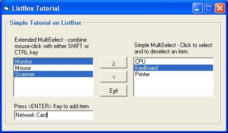

<div align="center">

## MultiSelect ListBox \(Adding and Removing Items\) \- For Absolute Beginners\!


</div>

### Description

This tutorial demonstrates multiselect property of listbox as well as how to add and remove items properly. Absolute beginners will surely grasp this concept easily.
 
### More Info
 


<span>             |<span>
---                |---
**Submitted On**   |2002-05-14 00:24:56
**By**             |[MöRNING](https://github.com/Planet-Source-Code/PSCIndex/blob/master/ByAuthor/m-rning.md)
**Level**          |Beginner
**User Rating**    |4.8 (19 globes from 4 users)
**Compatibility**  |VB 6\.0
**Category**       |[Custom Controls/ Forms/  Menus](https://github.com/Planet-Source-Code/PSCIndex/blob/master/ByCategory/custom-controls-forms-menus__1-4.md)
**World**          |[Visual Basic](https://github.com/Planet-Source-Code/PSCIndex/blob/master/ByWorld/visual-basic.md)
**Archive File**   |[MultiSelec827815142002\.zip](https://github.com/Planet-Source-Code/m-rning-multiselect-listbox-adding-and-removing-items-for-absolute-beginners__1-34765/archive/master.zip)


### Source Code

```

Download the file and run it! In the meantime here's the code....
' Very Basic tutorial on multi-select property of listbox, how to add and remove items from it
' To add items to a list box, use "AddItem" method (See the form's Load event for an example)
' To Remove an item from list box, use "RemoveItems" method (see the command button's click event)
'
'  Multi-Select property of list box
'  0 - Mone   -> No multiselection feature, you can only select one item (this is the default)
'  1 - Simple  -> you can multiselect by clicking an item, and deselecting, by clicking also (see lstThing object)
'  2 - Extended -> Multiselect by combining mouse-click with either SHIFT key or CTRL     (see lstItems object)
'
' This is intended for absolute beginners.
' If you find this useful, please vote.
' thanks and if you have questions, just contact me.
' my email : cMorning30@hotmail.com
'
Option Explicit
Private Sub cmdBack_Click()
  Dim intSelect As Integer  ' declare a variable representing the index of the listbox
  intSelect = 0        ' of course, set it to 0, the starting point of its index value
                ' it's ok if you dont assign values, it will be set to its default value, which is 0
                ' but its always a good programming practice to assign values to a variable
  ' Loop inside the list box and test the item if it is selected
  While intSelect < (lstThings.ListCount)
    If lstThings.Selected(intSelect) = True Then
      lstItems.AddItem lstThings.List(intSelect)
      lstThings.RemoveItem intSelect
    Else
      intSelect = intSelect + 1  ' increment this by one, so we can move on the the next item in the list
    End If
  Wend
End Sub
Private Sub cmdExit_Click()
  Unload Me
End Sub
Private Sub cmdRemove_Click()
  Dim intSelect As Integer  ' declare a variable representing the index of the listbox
  intSelect = 0        ' of course, set it to 0, the starting point of its index value
                ' it's ok if you dont assign values, it will be set to its default value, which is 0
                ' but its always a good programming practice to assign values to a variable
  ' Loop inside the list box and test the item if it is selected
  While intSelect < (lstItems.ListCount)
    If lstItems.Selected(intSelect) = True Then
      lstThings.AddItem lstItems.List(intSelect)   'it is important to add the items first to the other listbox
                              ' otherwise, it will add the wrong value!
      lstItems.RemoveItem intSelect          ' then remove it from the original list box
    Else
      intSelect = intSelect + 1  ' increment this by one, so we can move on the the next item in the list
    End If
  Wend
' note that we can not use FOR Loop here because if we remove an
' item from the listbox, the listcount acually decreases by one,
' therefore making the FOR value inconsistent with the index.
' you may want try it, if want to experiment.
End Sub
Private Sub Form_Load()
  'Center the form
  Top = (Screen.Height - ScaleHeight) / 2
  Left = (Screen.Width - ScaleWidth) / 2
  ' Make sure that the SORTED Property of the list box is set to true, and the
  ' MULTISELECTED Property set to 2 - Extended, meaning you can multiselect by holding down SHIFT or CTRL key
  ' because you can't assign values to these properties at run time
  ' The other list box, named lstThings, has a multiselect property of 1 - Simple
  ' you'll know the difference between 1 and 2 once you run the program.
  'Initialize Items listbox
  With lstItems
    .AddItem "CPU"
    .AddItem "Monitor"
    .AddItem "Mouse"
    .AddItem "KeyBoard"
    .AddItem "Printer"
    .AddItem "Scanner"
  End With
End Sub
Private Sub Form_Unload(Cancel As Integer) ' this is a pretty straight-forward thing
  Dim intEx As Integer
  intEx = MsgBox("Are you sure you want to exit?", vbYesNo + vbCritical + vbDefaultButton1, "Exit")
  If intEx = vbYes Then    ' vbYes is a VB constant that has an integer equivalent
                ' that's the reason why we declared intEx as integer
    End
  Else
    Cancel = 1       ' set this to true so the form won't exit
  End If
End Sub
Private Sub txtAddItem_KeyPress(KeyAscii As Integer)
If KeyAscii = 13 Then      ' <ENTER> Key was pressed
  If Trim(txtAddItem.Text) <> "" Then   ' check if textbox is empty
    lstItems.AddItem txtAddItem.Text  ' if not, add it to listbox
    txtAddItem.Text = ""        ' and set the textbox empty for another item
  Else
    MsgBox "Unable to add empty item.", vbOKOnly + vbCritical, "Add"
  End If
  txtAddItem.SetFocus
End If
End Sub
```

